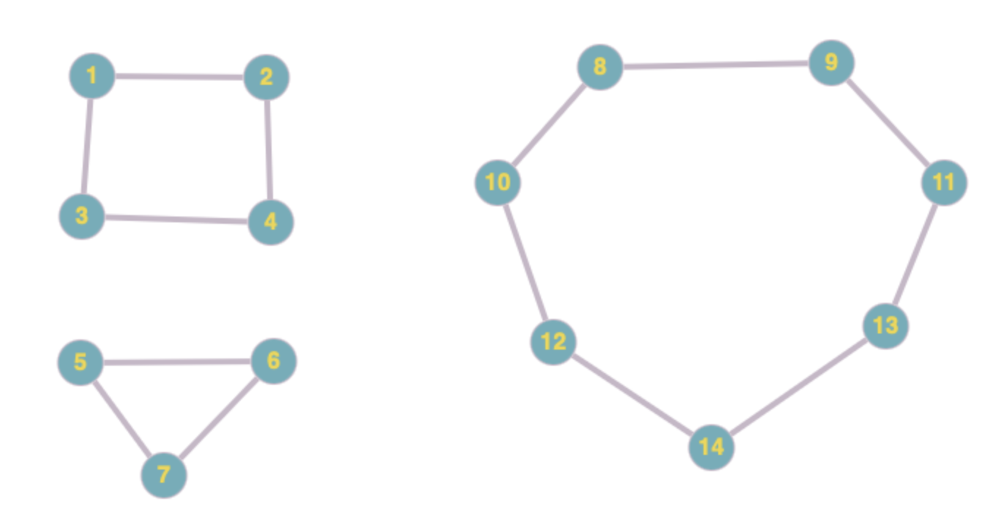

# Apuntes TG - Miguel Toro
## Nociones Básicas MD (2)

### Grafos Árbol
Un **árbol** es un grafo conexo y acíclico (sin ciclos). Propiedades importantes:
- Es un grafo conexo sin ciclos.
- Es un grafo con un único camino simple entre cada dos vértices.
- Es un grafo conexo que al eliminar cualquier arista se produce un bosque de dos árboles.
- Es un grafo conexo con $n$ vértices y $n-1$ aristas.
- Es un grafo sin ciclos con $n$ vértices y $n-1$ aristas.

Un **bosque** es un grafo acíclico que puede tener varios componentes conexos (varios árboles).

#### Algunas Propiedades
1) Si a un árbol se le añade una arista se genera un ciclo.
2) Si eliminamos otra arista del ciclo así obtenido se obtiene otro árbol, no necesariamente isomorfo al anterior.
3) Si $G=(V,A)$ es un bosque con $c$ componentes conexas (árboles), entonces $n_v = n_a + c$.
4) Si a un árbol le añadimos un vértice y una arista incidente en él, se obtiene un nuevo árbol.

### Árboles Recubridores
Un **árbol recubridor** (spanning tree) de un grafo conexo G es un subgrafo que:
- Es un árbol (conexo y sin ciclos)
- Incluye todos los vértices del grafo original
- Tiene exactamente $n-1$ aristas (donde $n$ es el número de vértices)

#### Algoritmo DFS para Árboles Recubridores

**Entrada**: Grafo conexo $G=(V,A)$

1. **P01**: Leer un grafo conexo $G=(V,A)$
2. **P02**: $V' = \emptyset$; $A' = \emptyset$ (vértices y aristas del árbol recubridor)
3. **P03**: $Q=\{x\}$, siendo $x \in V$ un vértice cualquiera del grafo $G$
4. **P04**: Marcar $x$ como visitado
5. **P05**: Añadir el vértice $x$ a $V'$
6. **P06**: Mientras que $Q \neq \emptyset$:
   - **P07**: $x$ = último elemento de $Q$
   - **P08**: Si $x$ es adyacente a algún vértice $y$ no visitado
     - **P09**: Añadir $y$ al final de $Q$
     - **P10**: Marcar $y$ como visitado
     - **P11**: Añadir a $A'$ la arista $\{x,y\}$; añadir a $V'$ el vértice $y$
   - **P12**: En caso contrario
     - **P13**: Quitar $x$ de la pila $Q$
7. **P14**: Retorna el árbol $T = (V',A')$

Este algoritmo utiliza búsqueda en profundidad (DFS) y garantiza encontrar un árbol recubridor válido para cualquier grafo conexo.

#### Algoritmo BFS para Árboles Recubridores
**Entrada**: Grafo conexo $G=(V,A)$

1. **P01**: Leer un grafo conexo $G=(V,A)$
2. **P02**: $V' = \emptyset$; $A' = \emptyset$ (vértices y aristas del árbol recubridor)
3. **P03**: $Q=\{x\}$, siendo $x \in V$ un vértice cualquiera del grafo $G$
4. **P04**: Marcar $x$ como visitado
5. **P05**: Añadir el vértice $x$ a $V'$
6. **P06**: Mientras que $Q \neq \emptyset$:
   - **P07**: $x$ = primer elemento de $Q$ (diferencia con DFS)
   - **P08**: Mientras exista un vértice $y$ no visitado, adyacente a $x$
     - **P09**: Añadir $y$ al final de $Q$
     - **P10**: Marcar $y$ como visitado
     - **P11**: Añadir a $A'$ la arista $\{x,y\}$; añadir a $V'$ el vértice $y$
   - **P12**: Eliminar $x$ de la cola $Q$
7. **P13**: Retorna el árbol $T = (V',A')$

#### Ejemplo Paso a Paso - Algoritmo DFS

Consideremos el grafo de la imagen anterior con vértices {v₁, v₂, v₃, v₄, v₅, v₆}:

| Paso | x | y | Pila (Q) | Vértices visitados (V') | Aristas (A') |
|------|---|---|----------|-------------------------|--------------|
| Inicio | v₁ | - | {v₁} | {v₁} | ∅ |
| P07-P11 | v₁ | v₃ | {v₁,v₃} | {v₁,v₃} | {v₁-v₃} |
| P07-P11 | v₃ | v₄ | {v₁,v₃,v₄} | {v₁,v₃,v₄} | {v₁-v₃,v₃-v₄} |
| P07-P11 | v₄ | v₂ | {v₁,v₃,v₄,v₂} | {v₁,v₃,v₄,v₂} | {v₁-v₃,v₃-v₄,v₄-v₂} |
| P07-P11 | v₂ | v₅ | {v₁,v₃,v₄,v₂,v₅} | {v₁,v₃,v₄,v₂,v₅} | {v₁-v₃,v₃-v₄,v₄-v₂,v₂-v₅} |
| P07-P11 | v₅ | v₆ | {v₁,v₃,v₄,v₂,v₅,v₆} | {v₁,v₃,v₄,v₂,v₅,v₆} | {v₁-v₃,v₃-v₄,v₄-v₂,v₂-v₅,v₅-v₆} |
| P07-P13 | v₆ | - | {v₁,v₃,v₄,v₂,v₅} | {v₁,v₃,v₄,v₂,v₅,v₆} | {v₁-v₃,v₃-v₄,v₄-v₂,v₂-v₅,v₅-v₆} |

#### Ejemplo Paso a Paso - Algoritmo BFS

Con el mismo grafo, empezando desde v₁:

| Paso | x | y | Cola (Q) | Vértices visitados (V') | Aristas (A') |
|------|---|---|----------|-------------------------|--------------|
| Inicio | v₁ | - | {v₁} | {v₁} | ∅ |
| P08-P11 | v₁ | v₃ | {v₁,v₃} | {v₁,v₃} | {v₁-v₃} |
| P08-P11 | v₁ | v₄ | {v₁,v₃,v₄} | {v₁,v₃,v₄} | {v₁-v₃,v₁-v₄} |
| P12 | - | - | {v₃,v₄} | {v₁,v₃,v₄} | {v₁-v₃,v₁-v₄} |
| P08-P11 | v₃ | v₆ | {v₃,v₄,v₆} | {v₁,v₃,v₄,v₆} | {v₁-v₃,v₁-v₄,v₃-v₆} |
| P12 | - | - | {v₄,v₆} | {v₁,v₃,v₄,v₆} | {v₁-v₃,v₁-v₄,v₃-v₆} |
| P08-P11 | v₄ | v₂ | {v₄,v₆,v₂} | {v₁,v₃,v₄,v₆,v₂} | {v₁-v₃,v₁-v₄,v₃-v₆,v₄-v₂} |
| P08-P11 | v₄ | v₅ | {v₄,v₆,v₂,v₅} | {v₁,v₃,v₄,v₆,v₂,v₅} | {v₁-v₃,v₁-v₄,v₃-v₆,v₄-v₂,v₄-v₅} |

**Resultado**: Ambos algoritmos producen árboles recubridores válidos pero con estructuras diferentes debido a su estrategia de exploración.

### Grafos Binarios
Un **árbol binario** es un árbol dirigido donde cada vértice tiene a lo sumo dos hijos: un **hijo izquierdo** y un **hijo derecho**.

##### Propiedades de Árboles Binarios
- **Raíz**: vértice sin padre (solo uno por árbol)
- **Hojas**: vértices sin hijos
- **Altura**: longitud del camino más largo desde la raíz hasta una hoja
- **Nivel**: distancia desde la raíz (la raíz está en nivel 0)

##### Tipos de Árboles Binarios
- **Árbol binario completo**: todos los niveles están completamente llenos excepto posiblemente el último
- **Árbol binario perfecto**: todos los niveles están completamente llenos
- **Árbol binario lleno**: cada vértice interno tiene exactamente dos hijos

##### Propiedades Cuantitativas
- **Máximo número de vértices en nivel $i$**: $2^i$
- **Máximo número de vértices en árbol de altura $h$**: $2^{h+1} - 1$
- **Altura mínima para $n$ vértices**: $\lfloor \log_2(n) \rfloor$
- **Para árbol binario completo con $n$ vértices**:
    - Número de hojas: $\lceil \frac{n}{2} \rceil$
    - Número de vértices internos: $\lfloor \frac{n}{2} \rfloor$

##### Recorridos de Árboles Binarios
- **Preorden**: raíz → subárbol izquierdo → subárbol derecho
- **Inorden**: subárbol izquierdo → raíz → subárbol derecho  
- **Postorden**: subárbol izquierdo → subárbol derecho → raíz

### Grafos Hamiltonianos
Un grafo es **hamiltoniano** si contiene un **ciclo hamiltoniano**: un ciclo que visita cada vértice exactamente una vez.

Un **camino hamiltoniano** visita cada vértice exactamente una vez pero no necesariamente regresa al vértice inicial.

#### Condiciones para Grafos Hamiltonianos
- **Teorema de Dirac**: Si $G$ tiene $n \geq 3$ vértices y cada vértice tiene grado $\geq \frac{n}{2}$, entonces $G$ es hamiltoniano
- **Teorema de Ore**: Si para cada par de vértices no adyacentes $u, v$ se cumple que $grado(u) + grado(v) \geq n$, entonces $G$ es hamiltoniano

### Grafos Eulerianos
Un grafo es **euleriano** si contiene un **circuito euleriano**: un circuito que recorre cada arista exactamente una vez.

#### Teorema de Euler
- Un grafo conexo es euleriano si y solo si todos sus vértices tienen grado par
- Un grafo conexo tiene un **camino euleriano** (pero no circuito) si y solo si tiene exactamente dos vértices de grado impar

#### Algoritmo de Hierholzer
Para encontrar un circuito euleriano:
1. Verificar que todos los vértices tengan grado par
2. Comenzar desde cualquier vértice y formar un circuito
3. Si quedan aristas sin usar, encontrar un vértice del circuito actual que tenga aristas sin usar
4. Formar un nuevo circuito desde ese vértice
5. Combinar los circuitos y repetir hasta usar todas las aristas

### Conectividad (n-Conexo)
Un grafo es **k-conexo** si:
- Permanece conexo después de eliminar cualquier conjunto de $k-1$ vértices
- Se requieren al menos $k$ vértices para desconectarlo

#### Conceptos Relacionados
- **Conectividad de vértices** $\kappa(G)$: número mínimo de vértices cuya eliminación desconecta el grafo
- **Conectividad de aristas** $\lambda(G)$: número mínimo de aristas cuya eliminación desconecta el grafo
- Se cumple: $\kappa(G) \leq \lambda(G) \leq \delta(G)$ donde $\delta(G)$ es el grado mínimo

#### Algoritmo de Ford-Fulkerson (para conectividad)
Se puede usar para determinar la conectividad máxima entre dos vértices:
1. Modelar el grafo como una red de flujo
2. Asignar capacidad 1 a cada arista
3. Encontrar el flujo máximo entre los vértices
4. El valor del flujo máximo es igual al número mínimo de aristas que deben eliminarse para desconectar esos vértices

## Ejercicios Tipo
### Buscar Todos los Grafos k-valentes con n Vértices
Esta tarea puede ser bastante larga, pues en algunos casos habría que probar con muchas posibilidades. Una forma de verlo es que, los grafos complementarios de los complementarios son la solución, por ejemplo.

Si queremos buscar los grafos 4-valentes de 7 vértices, bastaría con buscar los grafos 2-valentes (que es el complementario) de 7 vértices. En este caso hay solo dos posibilidades:

Bastaría con hacer los complementos de cada uno, y ya tendríamos la solución.
