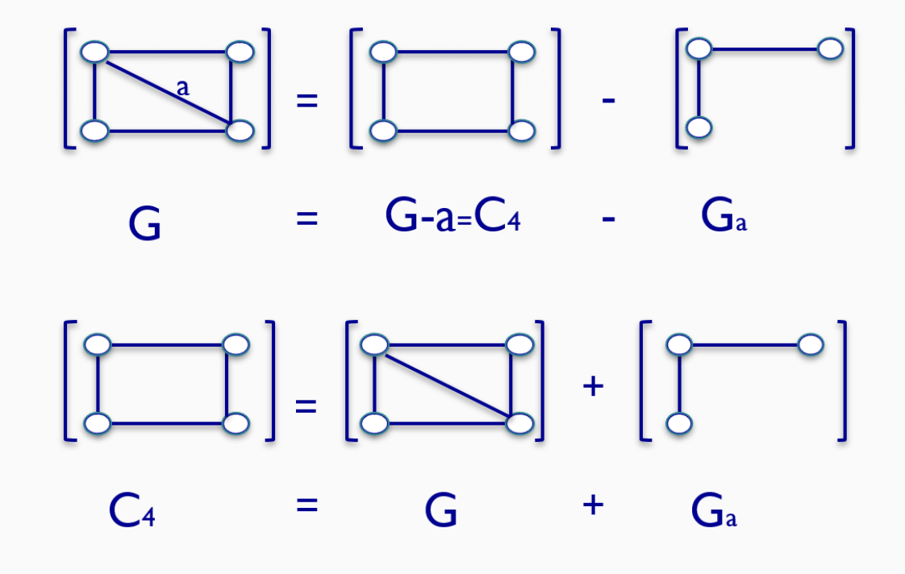

# Formulario TG

## Índice

- [Cuestionario 1: Repaso](#cuestionario-1-repaso)
- [Cuestionario 2: Repaso](#cuestionario-2-repaso)
- [Cuestionario 3](#cuestionario-3)
    - [Coloración](#coloración)
    - [Número de Independencia](#número-de-independencia)
- [Cuestionario 4](#cuestionario-4-criticidad-y-polinomio-cromático)
    - [Criticidad](#criticidad)
    - [Polinomio Cromático](#polinomio-cromático)
- [Cuestionario 5: Dimensión Métrica](#cuestionario-5-dimensión-métrica)
- [Cuestionario 6](#cuestionario-6)
    - [Número Resolutivo](#número-resolutivo)
    - [Dominación](#dominación)
- [Cuestionario 7: Centralidad](#cuestinario-7-centralidad)

## Cuestionario 1: Repaso

De este cuestionario basta con saber lo básico de los grafos, no piden mucho.

### LAM

$$|A|=\frac{\sum_{v\in V} deg(v)}{2}$$

### Diámetro y Radio

- Diámetro es la máxima excentricidad.
- Radio es la mínima escentricidad.

La excentricidad de cada vértice se calcula aplicando un `BFS`.

## Cuestionario 2: Repaso

Saber lo mínimo.

## Cuestionario 3

### Coloración

- Cota Superior: encontrar una coloración (óptima) con el algoritmo voraz.
- Cota Inferior: aplicar un método inductivo o usar coloraciones de grafos ya conocidos.

### Número de Independencia

- Cota Superior: $\alpha(G) = \sum^c \alpha(G_c)$.
- Cota Inferior: encontrarla usando el algoritmo voraz.

## Cuestionario 4

### Criticidad

Un grafo crítico es aquel que si eliminamos un vértice, baja su número cromático. Un grafo es k-crítico si su número cromático es k y es crítico.

### Construcción de Dirac

Sea G un grafo k-crítico y H un grafo m-crítico entonces el grafo G+H es un grafo (k+m)-crítico.

### Construcción de Hajós

Dados dos grafos G y H. Sean uu’ una arista de G y vv’ una arista de H. El grafo G∧H se obtiene identificando los vértices u y v, borrando las aristas uu’ y vv’, y añadiendo la arista u’v’.

Obtenemos un grafo con la misma criticidad pero con un vértice y una arista menos.

### Polinomio Cromático

Polinomios Cromáticos conocidos:

- $P(O_n, k) = k^n$
- $P(K_n, k) = k(k−1)(k−2). . . (k−n + 1)$
- $P(P_n, k) = k(k−1)^{n−1}$

`Algoritmo Eliminación-Contracción:` Sean G un grafo, a = {u, v } una arista suya y k un número natural, entonces:

$$P(G , k) = P(G−a, k)−P(G_a, k)$$

#### Datos Curiosos Polinomio Cromático

## Cuestionario 5: Dimensión Métrica

- Cota Superior: encontrando una base métrica con algoritmo voraz, o aplicando: $\beta(G) \leq n-d$.
- Cota Inferior: con una inducción (probando o viendo las posibles etiquetas), o aplicando: $\beta(G) \geq k$. Siendo $k+d^k \geq n$.

Nota: si tiene vértices gemelos, si o sí alguno de los dos tienen que estar en la base métrica para que se puedan distinguir.

## Cuestionario 6

### Número Resolutivo

- Cota Inferior: $Res(G) \geq k$ si se encuentra un conjunto de vértices de orden $k$ que no sea conjunto resolutivo de $G$.
- Cota Superior: jajaja

### Dominación

Sea $G = (V ,A)$ un grafo y $S ⊂V$ un conjunto de vértices, diremos que S es un conjunto dominante de $G$ si para todo $v ∈V /S$ existe un $s ∈S$ tal que ${v ,s}∈A$.
Es decir, si todos los vértices que no están en $S$ son adyacentes a al menos un vértice se $S$.

- Cota Inferior:
    - $\gamma(G) \ge \left\lceil \frac{d+1}{3} \right\rceil = \left\lceil \frac{d}{3} \right\rceil + 1$
    - $\gamma(G) \ge \left\lceil \frac{n}{{\Delta}({G}) + 1} \right\rceil$
- Cota Superior: Algoritmo voraz, o aplicando: $\gamma(G) \le \left\lfloor \frac{n}{2} \right\rfloor$.

#### Algoritmo para Calcular el Número de Dominación de un Árbol

1. Incluimos en el conjunto de dominación a todos los
padres de alguna hoja del árbol.
2. Borramos del árbol todos los adyacentes de los
vértices que hemos incluido en el conjunto de dominación.
3. Volvemos al Paso 1 hasta que no tengamos vértices.

## Cuestinario 7: Centralidad

[Volver al Inicio](#índice)
